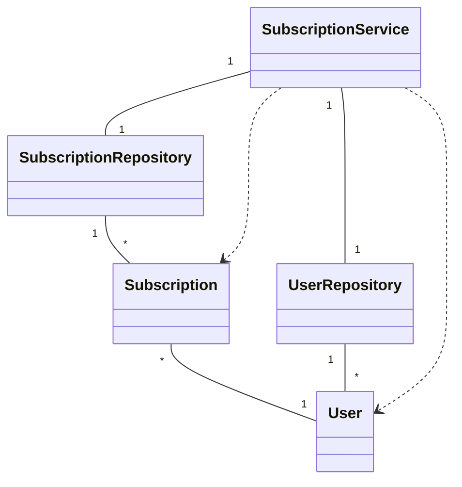
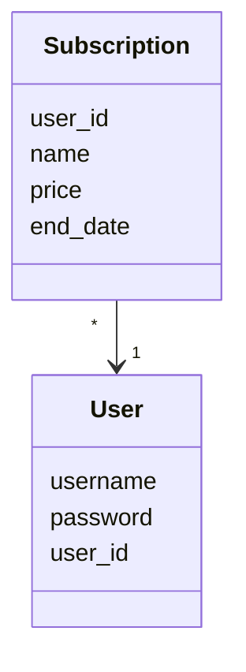

# Arkkitehtuurikuvaus
## Ohjelman rakenne

## Sovelluslogiikka
Sovelluslogiikassa ovat käytössä luokat User ja Subscription, jotka kuvaavat käyttäjiä ja heidän aktiivisia tilauksiaan:

Sovelluksen toiminnasta vastaa luokan SubscriptionService olio. Käyttäjien ja tilausten tietojen tallennus tapahtuu SQLite -tietokantaan luokkien UserRepository ja SubscriptionRepository kautta.
