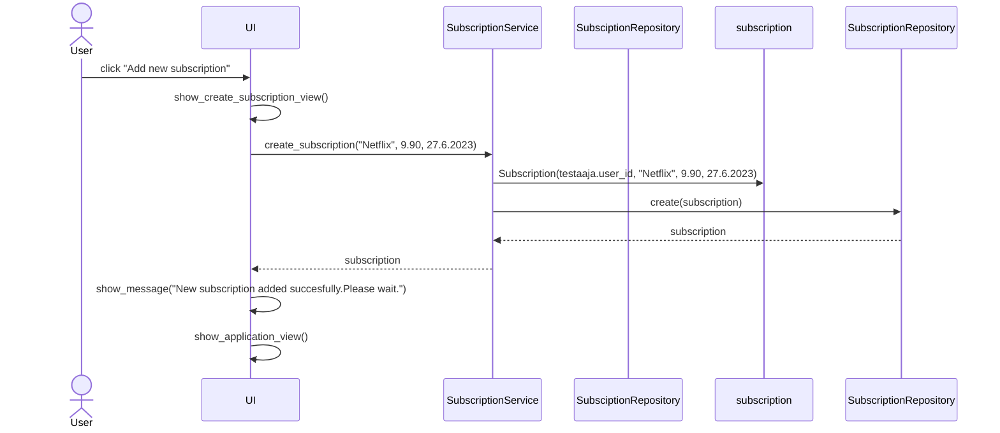

# Arkkitehtuurikuvaus
## Ohjelman rakenne

## Käyttöliittymä
Käyttöliittymä sisältää neljä erillistä näkymää:

- Kirjautuminen
- Uuden käyttäjän luominen
- Tilausnäkymä *(sovelluksen päänäkymä)*
- Uuden tilauksen luominen
 
## Sovelluslogiikka
Sovelluslogiikassa ovat käytössä luokat User ja Subscription, jotka kuvaavat käyttäjiä ja heidän aktiivisia tilauksiaan:

Sovelluksen toiminnasta vastaa luokan SubscriptionService olio. Käyttäjien ja tilausten tietojen tallennus tapahtuu SQLite -tietokantaan luokkien UserRepository ja SubscriptionRepository kautta.

## Tietojen pysyväistallennus
Pakkauksessa *repositories* sijaitsevat luokat *UserRepository* ja *SubscriptionRepository* vastaavat tietojen tallennuksesta SQLite-tietokantaan. Luokat noudattavat Repository-suunnitteumallia ja ne voidaan tarvittaessa korvata uusilla toteutuksilla. Sovelluslogiikan testaamisessa ei tallenneta lainkaan tietokantaan, vaan testit tallentavat tiedot suoraan keskusmuistiin.

## Päätoiminnallisuudet
Seuraavissa alaluvuissa kuvataan sovelluksen kolme tärkeintä päätoiminnallisuutta sekvenssikaavioiden avulla.
### Käyttäjän luominen
Sovelluksen avausnäkymän *Create user* -painiketta klikkaamalla sovellus siirtyy käyttäjän luomisnäkymään. Luomisnäkymässä syötetään toivottu käyttäjätunnus sekä salasana ja painetaan *Create user* -painiketta, minkä jälkeen sovelluksen kontrolli etenee seuraavasti:

*"Create user"* -painikkeen painaminen aktivoi tapahtumankäsittelijän kutsumaan sovelluslogiikan *SubscriptionService* metodia *create_user* antaen parametreiksi halutun käyttäjätunnuksen ja salasanan. Sovelluslogiikka selvittää *UserRepository*:a hyödyntämällä, onko käyttäjätunnus jo olemassa. Mikäli on, sovelluslogiikka tuottaa *UsernameExistsError*-poikkeuksen.

Mikäli haluttua käyttäjätunnusta ei ole käytössä, sovelluslogiikka luo uuden *User*-olion ja tallentaa lähettämällä kutsun *UserRepository*:n metodille *create_user*. Tapahtumankäsittelijä välittää käyttäjälle viestin käyttäjän onnistuneesta luonnista ja pyytää käyttäjää odottamaan. Tämän jälkeen käyttöliittymän näkymä palaa takaisin *LoginView* -näkymään. Käyttäjää edellytetään kirjautumaan erikseen sisään juuri luomillaan tunnuksilla.
### Käyttäjän kirjautuminen
Käyttäjä voi kirjautua sisään kirjautumisnäkymässä syöttämällä käyttäjätunnuksensa sekä salasanansa ja klikkaamalla *Login* -painiketta. Tämän seurauksena sovelluksen kontrolli toimii näin:

*Login* -painike aktivoi tapahtumankäsittelijän kutsumaan sovelluslogiikan *SubscriptionService* metodia *login*, joka sisältää parametrit käyttäjätunnukselle ja salasanalle. *SubscriptionService* puolestaan lähettää kutsun *UserRepository*:n metodille *find_user* antaen parametreiksi samat juuri saamansa käyttäjätunnuksen ja salasanan. 

Mikäli tietokannasta ei löydy kyseistä riviä eli käyttäjää, palautuu None. Tämän seurauksena *SubscriptionService* tuottaa *InvalidCredentialsError*:in.

Jos käyttäjä löytyy, käyttöliittymä vaihtaa näkymäksi *CreateApplicationView*:n, joka avaa käyttäjälle sovelluksen päänäkymän sekä näyttää mahdolliset aiemmin lisätyt tilaukset.
### Uuden tilauksen lisääminen
Sovelluksen päänäkymässä käyttäjä pääsee lisäämään uusia tilauksia klikkaamalla painiketta *"Add new subscription"*. Käyttöliittymä vaihtuu tällöin *CreateSubscriptionView* -näkymään, jonka jälkeen sovelluksen kontrolli etenee seuraavasti:

Tapahtumankäsittelijä kutsuu sovelluslogiikan *SubscriptionService* metodia *create_subscription*, jolle annetaan parametrina käyttäjän syöttämät tiedot uudesta tilauksesta. Sovelluslogiikka luo uuden *Subscription* -olion ja tallentaa sen tietokantaan kutsumalla *SubscriptionService*:n metodia *create*. 

Mikäli tiedot tallennetaan tietokantaan onnistuneesti, käyttöliittymä välittää tästä käyttäjälle viestin ja pyytää odottamaan. Tämän jälkeen käyttöliittymä siirtyy takaisin sovelluksen päänäkymään *CreateApplicationView*.
