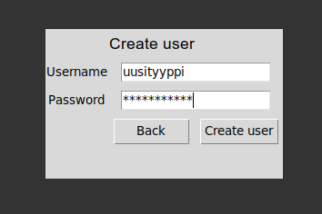

# Käyttöohje
## Ohjelman käynnistäminen
Aloita asentamalla ohjelman riippuvuudet komennolla:
```bash
poetry install
```
Jatka seuraavaksi alustustoimenpiteiden suoritukseen komennolla:
```bash
poetry run invoke build
```
Suoritettuasi edellä mainitut toimenpiteet, voit käynnistää sovelluksen komennolla:
```bash
poetry run invoke start
```
## Kirjautuminen
Sovellus käynnistuu kirjautumisnäkymään:


Mikäli käyttäjätunnus on jo olemassa, kirjautuminen onnistuu syöttämällä tunnuksen ja salasanan niille varattuihin kenttiin ja painamalla "Login" -painiketta. Mikäli käyttäjätunnusta ei ole, pääsee tunnuksen luomaan klikkaamalla "Create user" -painiketta.
## Uuden käyttäjän luominen
Siirryttyäsi kirjautumisnäkymästä tunnuksenluontinäkymään, voidaan uusi käyttäjätunnus luoda syöttämällä toivottu käyttäjätunnus ja salasana niille varattuihin kenttiin ja painamalla "Create user" -painiketta.



Sovellus antaa ilmoituksen, mikäli käyttäjätunnuksen luonti on onnistunut ja siirtyy tämän jälkeen automaattisesti takaisin kirjautumisnäkymään. 
## Tilausnäkymä
Kirjautumisnäkymästä päästään olemassaolevilla tunnuksilla kijautumaan tilausnäkymään, jossa nähdään käyttäjän voimassaolevat tilaukset:

Uuden tilauksen pääsee lisäämään painamalla "Add new subscription" -painiketta.

Painikkeesta "Logout" pääsee kirjautumaan ulos sovelluksesta, jolloin sovellus palautuu takaisin kirjautumisnäkymään.
## Uuden tilauksen luominen
