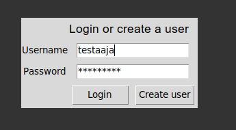
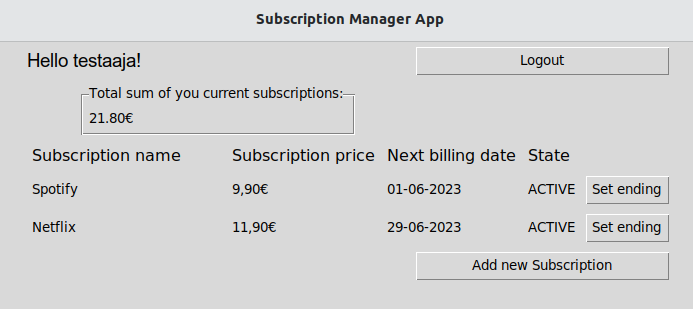

# Käyttöohje

## Konfiguraatio
Sovelluksen tallennuksessa käytettäviä tiedostonimiä on mahdollista konfiguroida .env-tiedostossa. Tiedoston muoto on seuraava:
```bash
DATABASE_FILENAME=database.sqlite
```

## Ohjelman käynnistäminen
Aloita asentamalla ohjelman riippuvuudet komennolla:
```bash
poetry install
```
Jatka seuraavaksi alustustoimenpiteiden suoritukseen komennolla:
```bash
poetry run invoke build
```
Suoritettuasi edellä mainitut toimenpiteet, voit käynnistää sovelluksen komennolla:
```bash
poetry run invoke start
```
## Kirjautuminen
Sovellus käynnistuu kirjautumisnäkymään:



Mikäli käyttäjätunnus on jo olemassa, kirjautuminen onnistuu syöttämällä tunnuksen ja salasanan niille varattuihin kenttiin ja painamalla "Login" -painiketta. Mikäli käyttäjätunnusta ei ole, pääsee tunnuksen luomaan klikkaamalla "Create user" -painiketta.
## Uuden käyttäjän luominen
Siirryttyäsi kirjautumisnäkymästä tunnuksenluontinäkymään, voidaan uusi käyttäjätunnus luoda syöttämällä toivottu käyttäjätunnus ja salasana niille varattuihin kenttiin ja painamalla "Create user" -painiketta.


Sovellus antaa ilmoituksen, mikäli käyttäjätunnuksen luonti on onnistunut ja siirtyy tämän jälkeen automaattisesti takaisin kirjautumisnäkymään. 
## Tilausnäkymä
Kirjautumisnäkymästä päästään olemassaolevilla tunnuksilla kirjautumaan tilausnäkymään, jossa nähdään käyttäjän voimassaolevat tilaukset:



Uuden tilauksen pääsee lisäämään painamalla "Add new subscription" -painiketta.

Painikkeesta "Logout" pääsee kirjautumaan ulos sovelluksesta, jolloin sovellus palautuu takaisin kirjautumisnäkymään.
## Uuden tilauksen luominen
Tilausnäkymästä on mahdollisuus siirtyä tilaustenlisäysnäkymään, jossa voidaan lisätä uusia tilauksia:

Tilauksista kirjataan ulos nimi, hinta sekä tilauksen päättymispäivä. Päättymispäivää seuraava päivä näytetään tilausnäkymän kohdassa *seuraava veloituspäivä*. Syötettävien tietojen muotovaatimukset on esitetty niitä vastaavien kenttien edellä. Mikäli käyttäjä kirjoittaa hinnan tai päättymispäivän väärässä muodossa, sovellus ilmoittaa tästä. Mikäli syötteet on annettu vaaditussa muodossa, sovellus antaa tästä ilmoituksen ja siirtyy tämän jälkeen automaattisest takaisin tilausnäkymään.
