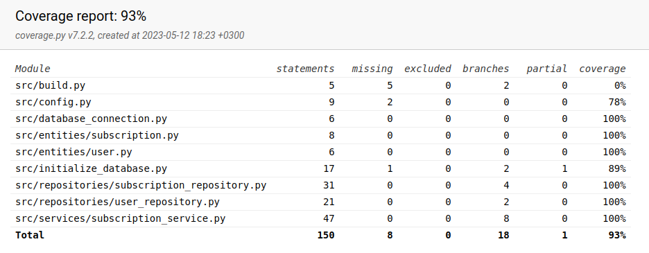

# Testausdokumentti
Ohjelmaa on testattu sekä automaattisilla testeillä (unittest), että manuaalisesti toteutetuilla järjestelmätason testeillä.

## Yksikkö- ja integraatiotestaus
### Sovelluslogiikka
Sovelluslogiikasta vastaavan *SubscriptionService*-luokan testauksesta vastaa luokka *TestSubscriptionService*.

### Repositorio-luokat
Tietojen pysyväistallennuksesta vastaavien luokkien *UserRepository* ja *SubscriptionRepository* testauksesta vastaavat luokat *TestUserRepository* ja *TestSubscriptionRepository*

### Testikattavuus
Käyttöliittymä on jätetty testauksen ulkopuolelle. Sovelluksen testauksen haaraumakattavuus on 93%

## Järjestelmätestaus
Sovelluksen järjestelmätestaus on suoritettu manuaalisesti Linux-ympäristössä.

### Asennus ja konfigurointi
Sovellusta on testattu lataamalla sen viimeisin *release* ja toimimalla [käyttöohjeessa](https://github.com/imhlas/ot-harjoitustyo/blob/master/harjoitustyo/dokumentaatio/kayttoohje.md) annettujen ohjeiden mukaisesti.

