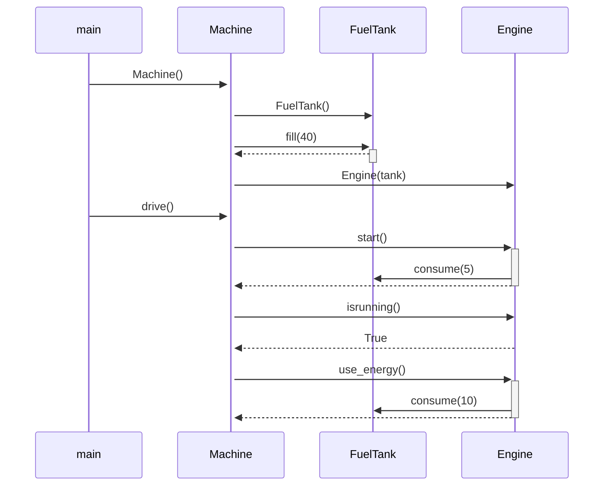
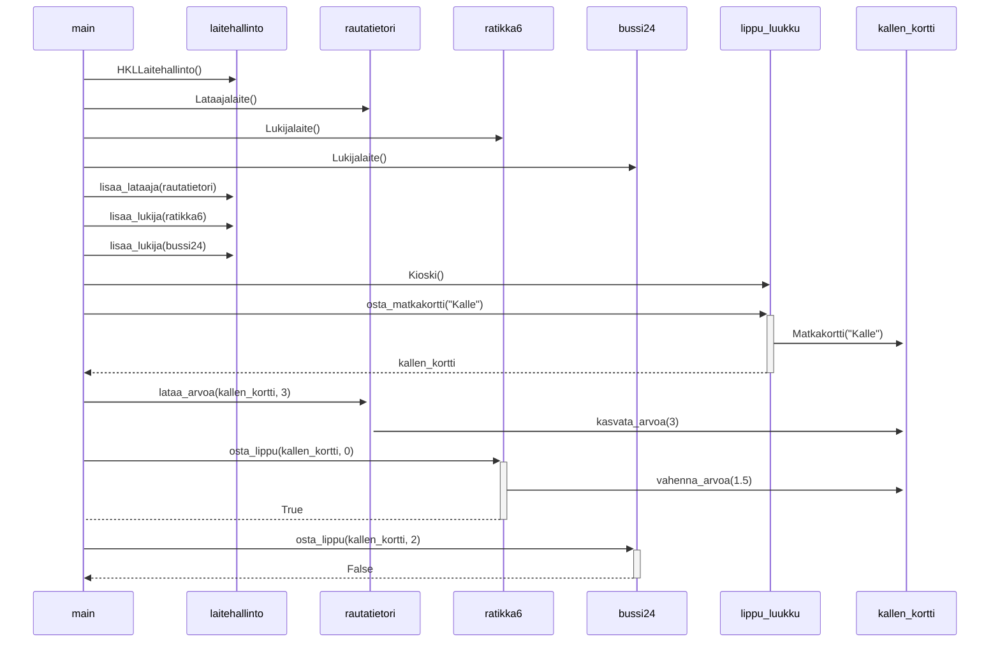

## Tehtävä 3 sekvenssikaavio

```mermaid
sequenceDiagram
    main->>+Machine: Machine()
    Machine->>FuelTank: FuelTank()
    Machine->>+FuelTank: fill(40)
    FuelTank-->>-Machine: 
    Machine->>Engine: Engine(tank)
    main->>Machine: drive()
    Machine->>+Engine: start()
    Engine->>FuelTank: consume(5)
    Engine-->>-Machine: 
    Machine->>Engine: isrunning()
    Engine-->>Machine: True
    Machine->>+Engine: use_energy()
    Engine->>FuelTank: consume(10)
    Engine-->>-Machine: 
```
## Tehtävä 4 sekvenssikaavio

```mermaid
sequenceDiagram
    main->>laitehallinto: HKLLaitehallinto()
    main->>rautatietori: Lataajalaite()
    main->>ratikka6: Lukijalaite()
    main->>bussi24: Lukijalaite()
    main->>+laitehallinto: lisaa_lataaja(rautatietori)
    main->>laitehallinto: lisaa_lukija(ratikka6)
    main->>laitehallinto: lisaa_lukija(bussi24)
    main->>lippu_luukku: Kioski()
    main->>+lippu_luukku: osta_matkakortti("Kalle")
    lippu_luukku->>+kallen_kortti: Matkakortti("Kalle")
    lippu_luukku-->>-main: kallen_kortti
    main->>+rautatietori: lataa_arvoa(kallen_kortti, 3)
    rautatietori->>kallen_kortti: kasvata_arvoa(3)
    main->>+ratikka6: osta_lippu(kallen_kortti, 0)
    ratikka6->>kallen_kortti: vahenna_arvoa(1.5)
    ratikka6-->-main: True
    main->>+bussi24: osta_lippu(kallen_kortti, 2)
    bussi24-->>-main: False
```
